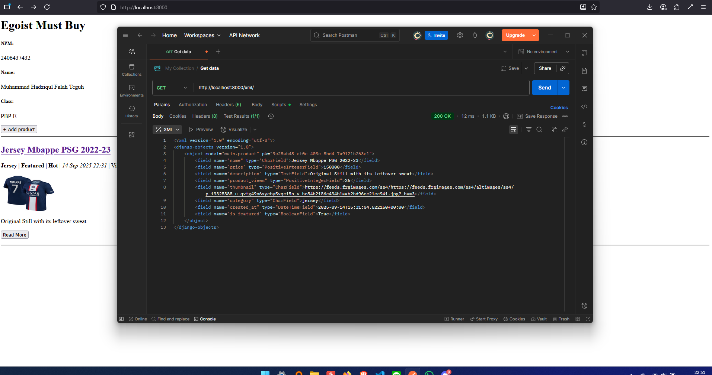

# TUGAS 3

## 1. Kepentingan _data-delivery_ dalam implementasi sebuah platform.
Data-delivery merupakan **penyajian atau penerimaan data** oleh user. Suatu platform sangat mungkin memerlukan data-delivery. Jika dalam suatu platform membutuhkan fitur seperti penyampaian informasi, konten video atau mungkin berita, maka platform tersebut akan memerlukan proses konfigurasi, pengiriman, dan penerimaan data. 

Ambillah contoh yang sering kita pakai seperti ojek online dan online food. Pemesanan makanan online mengimplementasikan data-delivery seperti saat kita memesan, saat pengantar sudah jalan, dan saat makanan sudah sampai. Segala perubahan data tersebut ditampilkan sehingga segala pengguna dalam transaksi tersebut dapat **memastikan kondisinya masing-masing**. Data delivery merupakan proses krusial yang dibutuhkan dalam penyajian data di dalam suatu platform.

## 2. JSON vs XML
JSON dan XML merupakan dua representasi data yang kerap dipakai dalam web service. Secara sejarah, XML ditemukan lebih dahulu pada tahun 1998 dan disusul dengan JSON pada tahun 2001. Sekarang JSON lebih terkenal dipakai untuk web service API dikarenakan beberapa keunggulannya dibanding XML; json menggunakan objek dictionary dan list yang mudah di-recognize oleh beberapa bahasa pemrograman, objek json sangat mudah untuk di-retrieve dengan contoh _data.name_, json menggunakan struktur key value yang mudah untuk diliat. 

Dengan beberapa alasan tersebut, hampir komunitas pengembang software setuju bahwa JSON merupakan representasi data yang lebih efektif digunakan dibanding XML. Meskipun begitu, karena XML memang keluaran yang lebih awal, terdapat beberapa sistem lama (legacy system) yang masih menerapkan pemakaian XML, sistem ini sayangnya susah dirancang untuk pemindahan pada JSON, maka segala developer yang mengurus harus tetap memahami cara XML bekerja.

## 3. Fungsi method is_valid()
Method is_valid() dalam project dipanggil setelah pembuatan objek ProductForm guna menvalidasi objek yang dibuat. Tanpa method is_valid(), maka form yang dibuat akan memiliki kemungkinan hasil yang tidak diinginkan.
Hal-hal yang divalidasi seperti memastikan semua fields terisi (bagi yang wajib diisi), memastikan tipe data yang dimasukkan sesuai, memberi validator pada field yang membutuhkan format sesuai (url, EmailField dll). 

## 4. csrf_token
Jika diliat pada file create_product.html, kita dapat melihat adanya  di dalam form element. CSRF merupakan singkatan dari _Cross-Site Request Forgery_, yang merupakan penyerangan cyber seorang exploiter. CSRF bekerja dengan cara orang yang tidak bertanggung jawab akan membuat website dengan tampilan normal. Di dalam website tersebut suatu button atau element interaksi lain dari web akan menimbulkan suatu request (biasanya POST) ke domain lain untuk mereka melakukan eksploitasi jahat seperti penghapusan akun, atau mungkin melakukan pengiriman data kredensial kepada penyerang tersebut. 

Dari situlah datang csrf_token sebagai layer of defense untuk melawan serangan CSRF. Di belakang form yang telah dibuat, dibuatlah suatu token validasi panjang yang dicocokkan setiap adanya POST request yang datang. Pada user yang memang datang dari domain yang sama, mereka akan secara otomatis menyimpan csrf_token tersebut dalam cookies, data tersebut yang nantinya akan memastikan bahwa user melakukan POST request dalam domain yang sama, dan bukan dari domain lain atau cross-site.

## 5. Implementasi CheckList
### Persiapan Forms Product
Kita siapkan project kita dengan membuat form yang nantinya digunakan untuk membuat suatu product baru. Buatlah forms.py di dalam main App.
```python
from django.forms import ModelForm
from main.models import Product

class ProductForm(ModelForm):
    class Meta:
        model = Product
        fields = ["name", "description", "category", "price", "thumbnail", "is_featured"]
```
Disini Form kita akan mengambil Product sebagai model dan akan memiliki fields yang tertera.
Sebagai referensi, isi dari models.py yang digunakan adalah sebagai berikut:
```python 
import uuid
from django.db import models

class Product(models.Model):
    CATEGORY_CHOICES = [
        ('jersey', 'Jersey'),
        ('shoes', 'Shoes'),
        ('socks', 'Socks'),
        ('gloves', 'Gloves'),
        ('kPads', 'Knee Pads'),
    ]
    
    id = models.UUIDField(primary_key=True, default=uuid.uuid4, editable=False)
    name = models.CharField(max_length=50)
    price = models.PositiveIntegerField(default=0)
    description = models.TextField()
    product_views = models.PositiveIntegerField(default=0)
    thumbnail = models.URLField(blank=True, null=False)
    category = models.CharField(max_length=20, choices=CATEGORY_CHOICES, default=None)
    created_at = models.DateTimeField(auto_now_add=True)
    is_featured = models.BooleanField(default=False)
  
    def __str__(self):
        return self.name
    
    @property
    def is_product_hot(self):
        return self.product_views > 20
        
    def increment_views(self):
        self.product_views += 1
        self.save()
```

### Konfigurasi Main Page
Berikut adalah tambahan konten yang ada di main.html
```html 
<h1>{{shop_name}}</h1>

<h5>NPM: </h5>
<p>{{ npm }}</p>

<h5>Name:</h5>
<p>{{ name }}</p>

<h5>Class:</h5>
<p>{{ class }}</p>

<a href="">
  <button>+ Add product</button>
</a>

<hr>


<p>Belum ada product pada dalam toko {{shop_name}}.</p>



<div>
  <h2><a href="">{{ product.name }}</a></h2>
    
  <p><b>{{ product.get_category_display }}</b> | 
    <b>Featured</b> | 
    <b>Hot</b> | <i>{{ product.created_at|date:"d M Y H:i" }}</i> 
    | Views: {{ product.product_views }}</p>
               
  
  
  <br />
  
  <p>Rp{{ product.price }},00</p>
  <p>{{ product.description|truncatewords:25 }}...</p>
    
  <p><a href=""><button>Read More</button></a></p>
</div>

<hr>



```
Perlu diperhatikan bahwa product_list disini adalah salah satu attribute yang di-pass saat pemanggilan show_main() melalui konfigurasi pada tahap-tahap selanjutnya.

### Template-template HTML untuk Product
Kita akan membutuhkan 3 file HTML baru yaitu create_product.html , product_detail.html , dan base.html. 
Perhatikan bahwa base.html disini adalah template html yang berada di root. Guna base.html disini adalah sebagai base configuration template lain (head meta charset, name, content). Nantinya template create_product.html dan product_detail.html akan dijadikan sebagai block content yang berada dalam base.html.

### Konfigurasi URL
Dalam urls.py, kita tambahkan beberapa path baru dalam urlpatterns:
```python
urlpatterns = [
    ...
    path('create_product/', create_product, name='create_product'),
    path('product/<str:id>/', show_product, name='show_product'),
    ...
]```

### Pembuatan Fungsi Render Products
Dalam views.py kita tambahan dua fungsi baru:
```python
def create_product(request):
    form = ProductForm(request.POST or None)

    if form.is_valid() and request.method == "POST":
        form.save()
        return redirect('main:show_main')

    context = {'form': form}
    return render(request, "create_product.html", context)

def show_product(request, id):
    product = get_object_or_404(Product, pk=id)
    product.increment_views()

    context = {
        'product': product
    }

    return render(request, "product_detail.html", context)
```
create_product() disini akan menerima dua tipe request yaitu GET atau POST. Berdasarkan tipe requestnya, maka keduanya akan dihandle secara berbeda.
show_product() akan mengambil object product yang sudah dibuat berdasarkan id dan mendisplay detail dari product tersebut.

### View XML dan JSON
Kita akan membuat akses untuk men-view data object yang sudah di display menggunakan XML dan JSON.
```python
def show_xml(request):
    product_list = Product.objects.all()
    xml_data = serializers.serialize("xml", product_list)
    return HttpResponse(xml_data, content_type="application/xml")

def show_json(request):
    product_list = Product.objects.all()
    json_data = serializers.serialize("json", product_list)
    return HttpResponse(json_data, content_type="application/json")

def show_xml_by_id(request, product_id):
    product_item = get_object_or_404(Product, pk=product_id)
    xml_data = serializers.serialize("xml", [product_item])
    return HttpResponse(xml_data, content_type="application/xml")

def show_json_by_id(request, product_id):
    product_item = get_object_or_404(Product, pk=product_id)
    json_data = serializers.serialize("json", [product_item])
    return HttpResponse(json_data, content_type="application/json")
```
Disini kita menggunakan HttpResponse dan serializers untuk mengubah object python pada bentuk yang sesuai.
Empat fungsi ini akan menampilkan representasi data dengan dua fungsi terakhir berguna men-view saat berada dalam detail product.

Lalu terakhir adalah men-set path untuk view XML dan JSON masing-masing.
```python
urlpatterns = [
    ...
    path('xml/', show_xml, name='show_xml'),
    path('json/', show_json, name='show_json'),
    path('xml/<str:product_id>/', show_xml_by_id, name='show_xml_by_id'),
    path('json/<str:product_id>/', show_json_by_id, name='show_json_by_id'),
    ...
]
```

## 6. Feedback untuk Asisten Dosen Tutorial 2
Tidak ada, terimakasih Kak.

## LAMPIRAN POSTMAN
### JSON Main Page

### XML Main Page

### JSON Product Detail Page

### XML Product Detail Page


